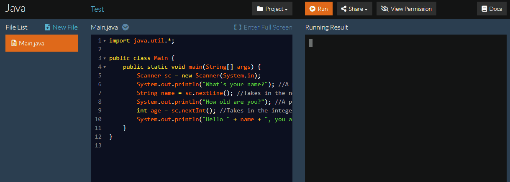

#Stdio
##System.out.print() and System.out.println()
Both System.out.print() and System.out.println() print out the resulting statement enclosed in the parentheses, the only difference is that System.out.println() prints the statement and then prints another new line with it.  

You can use the "+" to append multiple things together.  

<span style="color:blue">**Example**</span>    
```java
System.out.println(3 + 4);

System.out.println(3 + "Strings" + 4);
```

Arithmetic operations are calculated within the parentheses if the mathematical operation comes before the String that is to be appended. To do math after the string in the print statement, surround the arithmetic part with parentheses.

<span style="color:blue">**Example**</span>    
```java
System.out.println(3 + 4); //This prints out 7

System.out.println(3 + 4 + "hi"); //This prints out 7hi

System.out.println("hi" + 3 + 4); //This prints out hi34

System.out.println("hi" + (3 + 4)); //This prints out hi7
```

## Formatting Print Statements
When formatting print statements you can use System.out.printf(string, args), where "string" is the entirety of the string you want to print with % and the type you want to use replacing where the variables will go and "args" is where you list out each argument in the order you want it to appear.

* ```%s``` is used for strings and characters.
* ```%d``` is used for integers, longs, bytes, and shorts
* ```%f``` is used for doubles and floats.

Between the percent sign and the letter for the type, you can put numbers to show how much space before the variable or how many digits to show in the variable.

<span style="color:blue">**Example**</span>
```java
int a = 5;
double b = 10.256;
String s = "Hello";
System.out.printf("%15s.\n", s);
// since "Hello" is 5 letters long, then "Hello" will now take up 15 spaces
// prints out "          Hello." (10 spaces (then "Hello"))

System.out.printf("%03d + %.2f = %.2f", a, b, (a + b));
// since "03" comes before d, it will print out the value stored in a as 3 digits, like 005
// ".2f" means it will print out the number rounded to the nearest 2 decimal places
// prints out "005 + 10.26 = 15.26"
```

---
##How to Use a Scanner
At the beginning of the program, you should have the import statement.
```java
import java.util.Scanner;
```

Then you must declare a Scanner, the scanner here is to be called "input".
```java
Scanner input = new Scanner(System.in);
```

Then, you call the scanner with any of the following functions, where input is the name of your new Scanner:

* input.next(): Returns the next token from the input as a String up until the space
* input.nextLine(): Returns the entire line from where the Scanner is currently pointing as a String.
* input.nextByte(): Takes the next element from the input as a byte
* input.nextShort(): Takes the next element from the input as a short
* input.nextInt(): Takes the next element from the input as a integer
* input.nextLong(): Takes the next element from the input as a long
* input.nextFloat(): Takes the next element from the input as a float
* input.nextDouble(): Takes the next element from the input as a double  
<br>
<br>
<span style="color:blue">**Example**</span>    
```java
System.out.println("What's your name?"); //A print statement to prompt the user
String name = sc.nextLine(); //Takes in the next line from the user
System.out.println("How old are you?"); //A print statement to prompt the user
int age = sc.nextInt(); //Takes in the integer from the user
System.out.println("Hello " + name + ", you are " + age + " years old");
```

