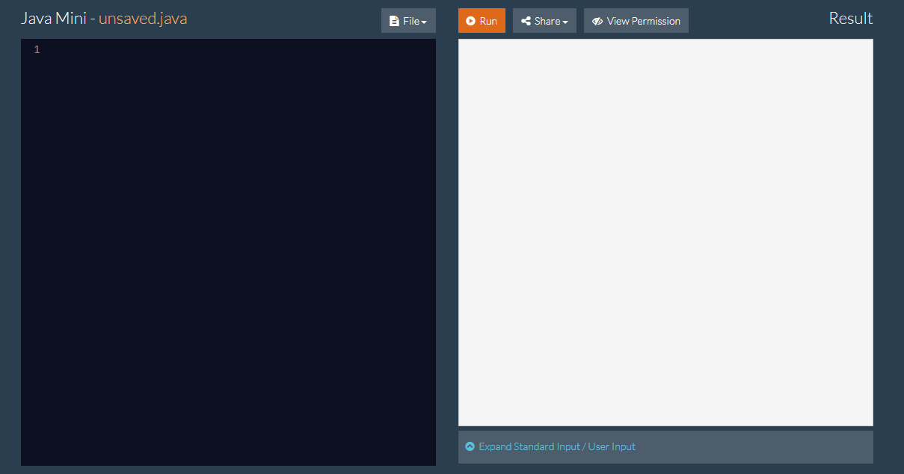
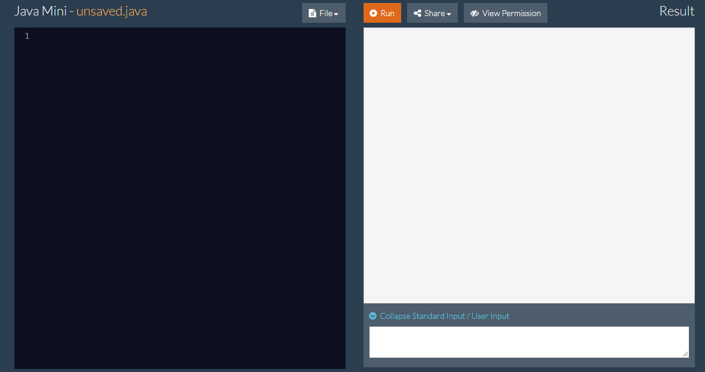

#Stdio
##System.out.print() and System.out.println()
Both System.out.print and System.out.println print out the resulting statement enclosed in the parentheses, the only difference is that System.out.println() prints the statement and then prints another new line with it.  

You can use the "+" to append multiple things together.  

<span style="color:blue">**Example**</span>    
```java
System.out.println(3 + 4); 

System.out.println(3 + "Strings" + 4);
```

Arithmetic operations are calculated within the parentheses if the mathematical operation comes before the String that is to be appended.  

<span style="color:blue">**Example**</span>    
```java
System.out.println(3 + 4); //This prints out 7

System.out.println(3 + 4 + "hi"); //This prints out 7hi

System.out.println("hi" + 3 + 4); //This prints out hi34
```

---
##How to Use a Scanner 
####How to Declare a Scanner
At the beginning of the program, you should have the import statement.
```java
import java.util.Scanner;
```

Then you must declare a Scanner, the scanner here is to be called "input".
```java
Scanner input = new Scanner(System.in);
```

Then, you call the scanner with any of the following functions, where input is the name of your new Scanner: 

* input.next(): Returns the next token from the input as a String up until the space
* input.nextLine(): Returns the entire line from where the Scanner is currently pointing as a String.
* input.nextByte(): Takes the next element from the input as a byte
* input.nextShort(): Takes the next element from the input as a short
* input.nextInt(): Takes the next element from the input as a integer
* input.nextLong(): Takes the next element from the input as a long
* input.nextFloat(): Takes the next element from the input as a float
* input.nextDouble(): Takes the next element from the input as a double  
<br>
<br>
<span style="color:blue">**Example**</span>    
```java
//If the input is "3 4 5 6 7 8 9"
System.out.println(input.next()); //Returns 3
System.out.println(input.nextLine()); 
//Returns " 4 5 6 7 8 9" since the pointer has already been advanced from the previous call.
```

<br/>
####Read Input in JavaMini
The way that the JavaMini works is that you must place the input _prior_ to running the program.   
<br>


Then, you click the up arrow at the bottom-right next to the "Expand Standard Input/User Input". It should look like the image below. 



Then you can input whatever input you wish to have, and then click the "Run" so your program would run with the parameters you wish. 
