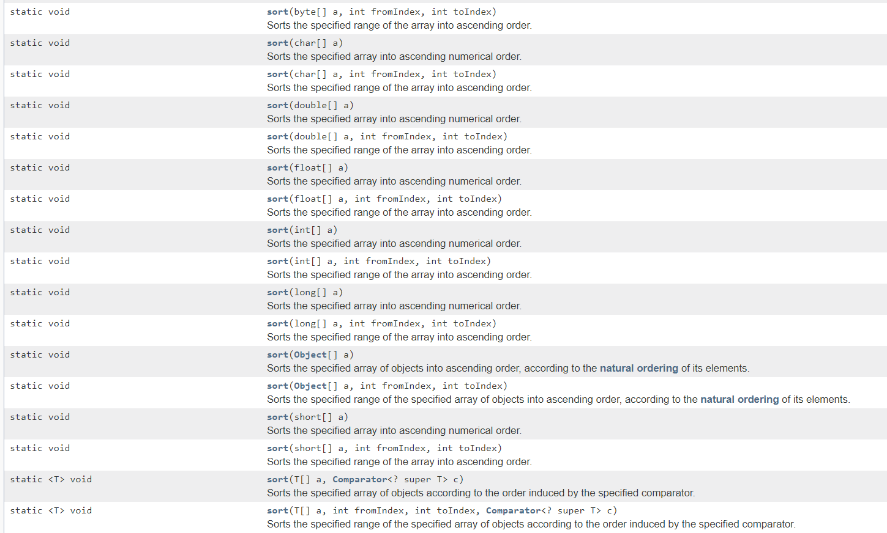

# Stdio

## Importing Packages
To import every class within a package in Java, you would write the following in your code before the class declaration:
``` java
// the general formula is:
import packageName.*;
// example:
import java.util.*;
```

If you want to import only one class from a library, you replace the asterisk in the last example with the class name:
``` java
// general formula:
import packageName.className;
// example:
import java.util.ArrayList;
```

### Object
<span style="font-size: 20px"><b>clone</b>  </span>  
Cloning in Java uses the .clone() method. The class must implement the Cloneable interface.
For the clone method, you must throw the exception that corresponds to the inferface.

<span style="color:blue">**Example**</span>    
```java
class Test implements Cloneable{
	public static void main(String[] args){

	}

	protected Object clone() throws CloneNotSupportedException{
	}
}  
```

#### Shallow Cloning v. Deep Cloning  
Shadow cloning creates an object that has the same references (if the field isn't a primitive type) as the original object.
Deep cloning copies all the separate field and creates new references for the new object so all it's contents are copies to a new object.

<span style="color:blue">**Shallow Clone Example**</span>    
```java
class Test implements Cloneable
{
    public Object clone() throws CloneNotSupportedException{
        return super.clone();
    }
}
```

<span style="color:blue">**Deep Clone Example**</span>    
```java
class Test implements Cloneable
{
    ArrayList c = new ArrayList<>();

    public Object clone() throws CloneNotSupportedException
    {
        Test t = (Test)super.clone();

        t.c = new ArrayList<>();

        // Create a new object for the field and assign it to shallow copy obtained to make it a deep copy
        return t;
    }
}
```


<span style="font-size: 20px"><b>toString</b></span>  

In an object, the toString() method returns the string representation of the object.
```java
class Test implements Cloneable{
	private int a;
	private int b;
	//Overriding the toString() method
	public String toString(){
		return "A: " + a + "B: " + b;
	}
}
```

### Integer and Double
Integer is the wrapper class for an integer(int) and Double is the wrapper class for a double, and these classes represents the numbers as objects.

<b> Autoboxing </b> is the automatic conversion that the Java complier makes from the primitive type to the wrapper class and <b> unboxing </b> is when the Java complier converts the wrapper class to the primitive type.

###### Converting Between int and Integer  
*   int -> Integer : Integer newInteger = new Integer(i);  
*   Integer -> int : Integer.valueOf(i)

###### Converting Between Double and double
* double -> Double : Double newDouble = new Double(d);
* Double -> double: double -> Double : d.doubleValue()  

<span style="color:blue">**Example**</span>     

```java
ArrayList<Integer> numberList = new ArrayList<Integer>;
numberList.add(22); //This is compiled as numberList.add(new Integer(22));
```

### String
The String class
###Math
##### Static Methods
* abs(a): This returns the absolute value of the number "a"
* sqrt(a): This returns the square root of the number "a"
* pow(a,b): This returns a<sup>b</sup>
* random(): This returns a number (0,1] (excluding 0 to including 1)
* min(a,b): This returns the minimum between a and b
* max(a,b): This returns the maximum between a and b
##### Variables
* Math.PI: Represents π
* Math.E: Represents e
##### How to call the methods  
The methods must be called using the dot notation and "Math" as the prefix.  
<br>
<span style="color:blue">**Example**</span>     
```java
double radius = 22;
double areaOfCircle = 2*Math.PI*radius;

double x = Math.min(22, 32); //This should assign 22 to the variable x
double y = Math.max(22, 32); //This should assign 32 to the variable y
```
### List&lt;E&gt; and ArrayList&lt;E&gt;
List&lt;E&gt; is an interface and java.util.ArrayList&lt;E&gt; implements List&lt;E&gt;. An ArrayList stores the elements within an <b> array</b>.  
<br>
Because ArrayList&lt;E&gt; implements List&lt;E&gt;, an ArrayList can be declared in two ways with the type of object between &lt; and &gt;:
```java
ArrayList<Integer> ints = new ArrayList<Integer>();
```

or  
```java
List<Integer> ints = new ArrayList<Integer>();
```

##### Methods Used for List&lt;E&gt; and ArrayList&lt;E&gt;
* int size(): Returns the number of values in the list
* boolean add(Object x): Adds Object x to the end of the list and returns true
* Object get(int index): Returns the object in the list at index
* Object set(int index, Object x): Sets the value at index to Object x and returns the old value at index
* Object remove(int index): Removes the value at index, shifts every element behind index towards the front of the list by 1 and returns the old value that was stored in index
* void add(int index, Object x): Adds Object x at index and shifts every element behind index towards the end of the list by 1
* boolean contains(Object x): Returns true if one of the elements in the List is equal to x
* int indexOf(Object x): Returns the index of the <b> first </b> occurence of x in the List and -1 if x never appears in the List
* boolean remove(Object x): If the List contains x, removes the <b> first </b> occurence and removes true, else returns false

<b> Note </b>:  
<i> add</i> and <i> remove </i> changes the size of the ArrayList.

<span style="color:blue">**Example**</span>     
```java
ArrayList<String> newList = new ArrayList<String>();
newList.add("Hello");
newList.add("HiThere");

for(String word: list)
	System.out.println(word + " ");
//Prints out Hello HiThere

System.out.println(newList.get(0)); //Prints out Hello
newList.add(0, "Hi");
System.out.println(newList.size()); //Prints out 3

for(String word: list)
	System.out.println(word + " ");
//Prints out Hi Hello HiThere
```

### Collection &lt;E&gt;, Collections and Arrays
#### Collection &lt;E&gt;
The Collection interface is typically used to move and manipulate groups of object with maximum generality.
###### Methods Used in Collection &lt;E&gt;
* boolean add(Element e): Makes Element e an element in the collection
* void clear(): Removes all elements in the collection
* boolean contains(Object o): Returns true is the Collection contains o
* boolean isEmpty(): Returns true is there are no elements in the collection
* boolean remove(Object o): Removes an instance of the element if it is present in the collection
* int size(): Returns the number of elements in the collection.

[More information about Collection &lt;E&gt; Here](https://docs.oracle.com/javase/7/docs/api/java/util/Collection.html)

#### Collections
This class consists of methods used to manipulate a Collection.
###### Methods Used in Collections
* static void reverse: Reverses the order or elements in a specified list
* static void shuffle: Randomly orders the specified list using the default source of randomness  

[More information about Collections Here](https://docs.oracle.com/javase/7/docs/api/java/util/Collections.html)

#### Arrays
This class consists of methods to manipulate arrays.
###### Methods Used in Arrays
* sort(byte[] a): Orders the Array a based on acsending numerical value.   

There are many different methods to sort in Arrays  



[More Information about Arrays Here](https://docs.oracle.com/javase/7/docs/api/java/util/Arrays.html)
